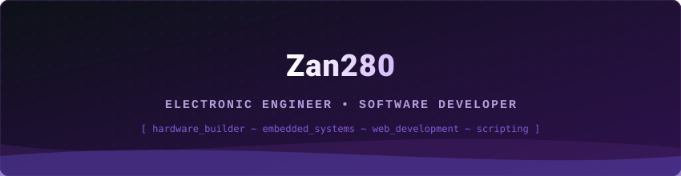

  <!-- BANNER LOCAL VECTORIAL -->
  

    

  <!-- GATO PIXEL ART LOCAL -->
  

   

  <!-- TEXTO ANIMADO TYPEWRITER (Codificado y sin emojis que rompan la URL) -->
  

    

  [English Version](README.md) | **Español**

---

### Resumen Profesional

Soy Ingeniero en Electrónica enfocado en el desarrollo de software y soluciones electrónicas. 
Desarrollador con experiencia integral de principio a fin: desde el diseño esquemático de PCBs y programación de microcontroladores hasta el despliegue de aplicaciones web modernas. 
Además, mantengo un aprendizaje continuo con experiencia práctica en sistemas Linux, apasionado por el hardware, el software y los videojuegos.

---

### Stack Tecnológico y Herramientas

  <!-- Backend y Web -->
  
  
  
  
  
  
  

    

  <!-- Hardware y Sistemas -->
  
  
  
  
  

---

### Proyectos Destacados

<table>
  <tr>
    <td width="50%" valign="top">
      <h3 align="center">☕ Gemelos Coffee POS</h3>
      

         Sistema Integral de Punto de Venta y Gestión Operativa: Solución completa de POS diseñada para cafeterías, optimizando la toma de pedidos, el control de inventario y la facturación.
      

      

        <b>Stack:</b> <code>Python</code> • <code>Django</code> • <code>React</code> • <code>MySQL</code> • <code>Docker</code>
      

      

        <a href="https://github.com/Zan280/pos-gemelos-coffee"><b>📂 Ver Repositorio</b></a>
      

    </td>
    <td width="50%" valign="top">
      <h3 align="center">⚡ Embedded & Electronics Lab</h3>
      

         Portafolio de Ingeniería Electrónica y Firmware: 
Colección de proyectos de sistemas embebidos que integran desarrollo de firmware en C/C++, prototipado rápido con ESP32/Arduino y diseño esquemático de PCBs personalizadas.
      

      

        <b>Stack:</b> <code>C/C++</code> • <code>ESP32</code> • <code>Arduino</code> • <code>Diseño de PCB</code>
      

      

        <a href="https://github.com/Zan280/coming-soon"><b>📂 Explorar Proyectos (Próximamente)</b></a>
      

    </td>
  </tr>
</table>

---

### Actividades y Métricas

  
  
  

---

### ¡Conectemos!

  

    
  
<i>"Depurando el código, ajustando el hardware."</i>

